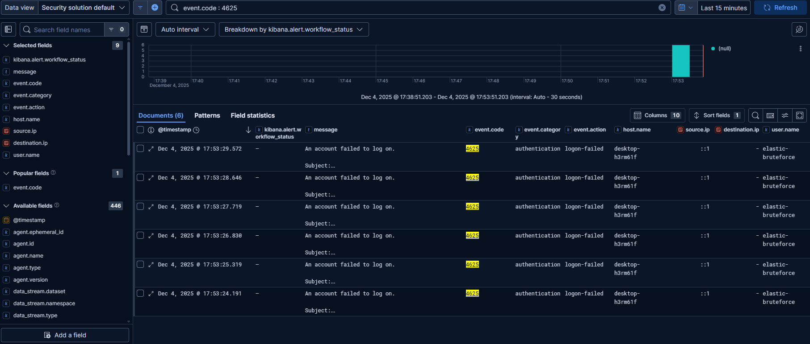
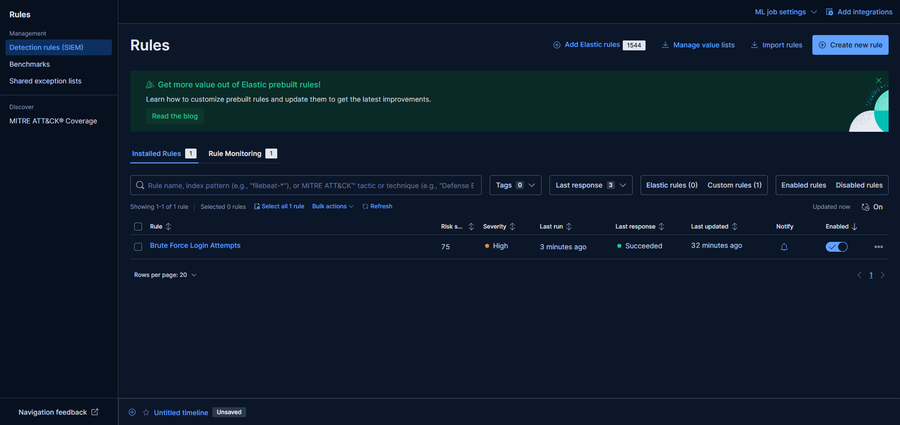
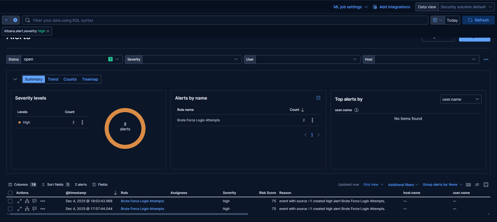
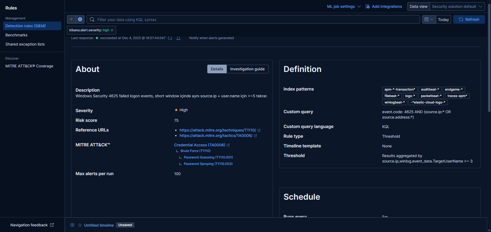

# 🔐 Elastic SIEM Brute Force Detection (Windows EventID 4625)

Bu projede, Windows güvenlik loglarından **başarısız kimlik doğrulama girişimlerini (Event ID: 4625)** Elastic SIEM üzerinde gerçek zamanlı olarak tespit eden bir **Brute Force Detection** kuralı geliştirdim.

---

## 🎯 Proje Amacı

- Kurumsal sistemlerde brute force login saldırılarını erken aşamada tespit etmek
- Windows loglama altyapısı ile SIEM arasında güçlü bir izleme hattı kurmak
- MITRE ATT&CK framework ile korelasyon sağlayarak analist görünürlüğünü artırmak

---

## ⚙️ Kullanılan Teknolojiler
- Elastic SIEM
- Elastic Agent
- Winlogbeat (Windows Event Logs)
- MITRE ATT&CK Mapping

## 🏗️ Mimari

[Windows Client]
⬇ Security Logs (EventID:4625)
[Elastic Agent + Winlogbeat]
⬇
[Elasticsearch] ➜ [Kibana SIEM] ➜ Alerting System


---

## ⚙️ Kurulum Bileşenleri

| Bileşen | Açıklama |
|--------|----------|
| Windows 10/11 Host | Test ortamı |
| Elastic Stack | Elasticsearch + Kibana |
| Elastic Agent | Log toplama ve security monitoring |
| Windows Security Logs | Authentication audit logs |

---

## 📌 Algılama Kuralı

**Threshold Logic** kullanıldı:  
➡ *5 dakika içerisinde aynı kullanıcıdan 5’ten fazla başarısız login girişimi olursa ALERT!*

KQL/Kibana Query:

```kql
event.code: 4625 AND (source.ip:* OR source.address:*)
```

🛑 Elastic SIEM Alert
→ “Brute Force Login Attempts”

🧩 MITRE ATT&CK Eşleştirmeleri
| Tactic                         | Technique               | Sub-technique                 |
| ------------------------------ | ----------------------- | ----------------------------- |
| **Credential Access (TA0006)** | **Brute Force (T1110)** | Password Guessing (T1110.001) |
|                                |                         | Password Spraying (T1110.003) |

Böylece rule, resmi MITRE saldırı modelleriyle uyumlu hale getirildi ✔


Kazanımlarım

✔ SIEM mimarisi
✔ Windows güvenlik logları 
✔ Anomali analizi & güvenlik korelasyonu 
✔ MITRE ATT&CK ile tespit kuralı 


Geliştirme Planı (Roadmap)
Sysmon Event Logs ile davranış analizi ekleme
Login source-IP coğrafi korelasyonu (GeoIP)
Elastic Machine Learning tetikleyici oluşturma

---

## 📸 Ekran Görüntüleri

### 🔹 1. Windows 4625 logları (Discover görünümü)


### 🔹 2. Detection Rule konfigürasyonu


### 🔹 3. Üretilen Alert


### 🔹 4. MITRE ATT&CK eşleşmesi



[LinkedIn Profili — Kaan Arda Uzun](https://www.linkedin.com/in/uzunkaana/)
